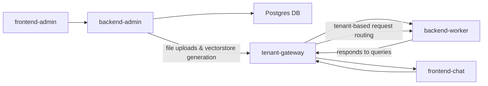

<p align="center">
  
</p>


# 🧠 LexoBot AI

> Scalable multi-tenant platform for document management and AI-based query answering, featuring backend administration, specialized workers, gateway, and web frontends for admin and end users.

## 🚀 Key Features
- 📄 Upload of regulation documents restricted to superusers.
- 💬 Chat interface for users to ask questions naturally.
- 🧠 Natural Language Processing using open-source AI models.
- 🔐 Access control to protect sensitive content and admin features.
- 🏘️ Designed for all community sizes: small, medium, or large condominiums.

## 💼 Use Cases
- Residents asking about specific rules or policies.
- Admins automating frequently asked questions.
- Improving transparency and communication in residential communities.

[](https://deepwiki.com/alejograjal/lexobot-ai)

---

## Table of Contents

- [Overview](#overview)
- [Architecture](#architecture)
- [Projects and Folders](#projects-and-folders)
- [Technologies](#technologies)
- [Installation and Deployment](#installation-and-deployment)
- [Configuration](#configuration)
- [Usage](#usage)
- [Workflow and Service Communication](#workflow-and-service-communication)
- [License](#license)
- [Roadmap and Future Improvements](#roadmap-and-future-improvements)
- [Contact](#contact)

---

## Overview

LexoBot-AI is a modular and scalable solution to allow multiple tenants (clients) to manage, upload, and query documents through an intelligent chat interface. It uses natural language processing to answer questions based on tenant-specific PDF documents.

The system is designed to support multi-tenant environments with decoupled services communicating through gateways and APIs, ensuring scalability, security, and flexibility.

---

## Architecture

- **backend-admin**: FastAPI REST API for tenant administration, users, roles, plans, and company-tenant assignments. Manages communication for file uploads, storage locations, and vectorstore generation.
- **backend-worker**: FastAPI service dedicated to processing user queries based on tenant PDFs, file uploads, and vectorstore generation for analysis.
- **frontend-admin**: Next.js application providing a web administration panel consuming backend-admin.
- **frontend-chat**: Next.js application for end users to interact via chat queries.
- **tenant-gateway**: Express microservice acting as a gateway to route requests to the corresponding backend-worker servers based on tenant.

---

## Projects and Folders

```
/
├── backend-admin         # FastAPI REST API for tenant and document management
├── backend-worker        # FastAPI API for tenant-based document queries and uploads
├── frontend-admin        # Next.js frontend for admin panel
├── frontend-chat         # Next.js frontend for end user chat interface
└── tenant-gateway        # Express gateway for multi-tenant routing
```

---

## Technologies

- **Backend**: Python 3.x, FastAPI, PostgreSQL, Alembic, Uvicorn, JWT, HMAC
- **Frontend**: Next.js, React
- **Gateway**: Node.js, Express
- **Security**:
  - **JWT-based authentication**
  - **HMAC-based request validation**
  - **Role-based access control**
- **Storage**: PostgreSQL databases, file system segregated per tenant
- **Containerization**: Docker
- **CI/CD**: GitHub Actions for automated testing and deployment
- **Others**: Vectorstores for NLP-based semantic search, JWT authentication, Docker for containerization
- **Cache**: Redis cache for frequent questions

---

## Installation and Deployment

Each project has its own configuration and deployment process, typically using Docker:

### Backend-admin

```bash
cd backend-admin
pip install -r requirements.txt
# Configure environment variables (.env)
uvicorn main:app --reload
# For production use Gunicorn or Uvicorn with multiple workers and Docker
```

### Backend-worker

Same as backend-admin.

### Frontend-admin and frontend-chat

```bash
cd frontend-admin
npm install
npm run dev
# For production
npm run build
npm start
```

### Tenant-gateway

```bash
cd tenant-gateway
npm install
npm start
```

> ⚙️ Dockerfiles are available for all services to facilitate containerized deployments.

---

## Configuration

- `.env` files per service (see `.env.example`)
- JWT secret, HMAC keys, database URLs, and API endpoints
- Alembic setup for schema migrations
- `tenants.json` config for dynamic tenant-to-worker mapping

---

## Usage

- Admins manage tenants and documents using **frontend-admin**.
- End users interact through **frontend-chat**, sending questions.
- The **tenant-gateway** forwards each request to the corresponding **backend-worker**.
- The **backend-worker** responds using vectorstore-powered document search.
- Authentication flows are enforced using JWT, with additional HMAC verification for sensitive operations.

---

## Workflow and Service Communication



## CI/CD and Deployment Pipelines

LexoBot-AI leverages **GitHub Actions** to automate builds, testing, and deployments:

- 🔄 **Pipeline 1**: Deploys `backend-admin` and `frontend-admin` via Docker to a remote VPS.
- 🔄 **Pipeline 2**: Deploys `frontend-chat` and `tenant-gateway` as a separate stack.

CI/CD Features:

- Automatic build and deploy on `main` branch
- Docker image builds and multi-service orchestration
- Environment secrets managed through GitHub repository settings
- Optional rollback strategies and health checks via custom scripts

---

## License

This project is licensed under the MIT License - see the [LICENSE](LICENSE) file for details.

---

## Roadmap and Future Improvements

- Enhance multi-tenant scalability with dynamic load balancing
- Add advanced authentication and authorization
- Integrate additional query channels (REST API, WhatsApp, etc.)
- Improve frontend UI/UX
- Implement centralized monitoring and logging
- Add tenant usage analytics and billing modules

---

## Contact

Alejandro Grajal  
Email: alejograjal@example.com  
GitHub: [https://github.com/alejograjal](https://github.com/alejograjal)